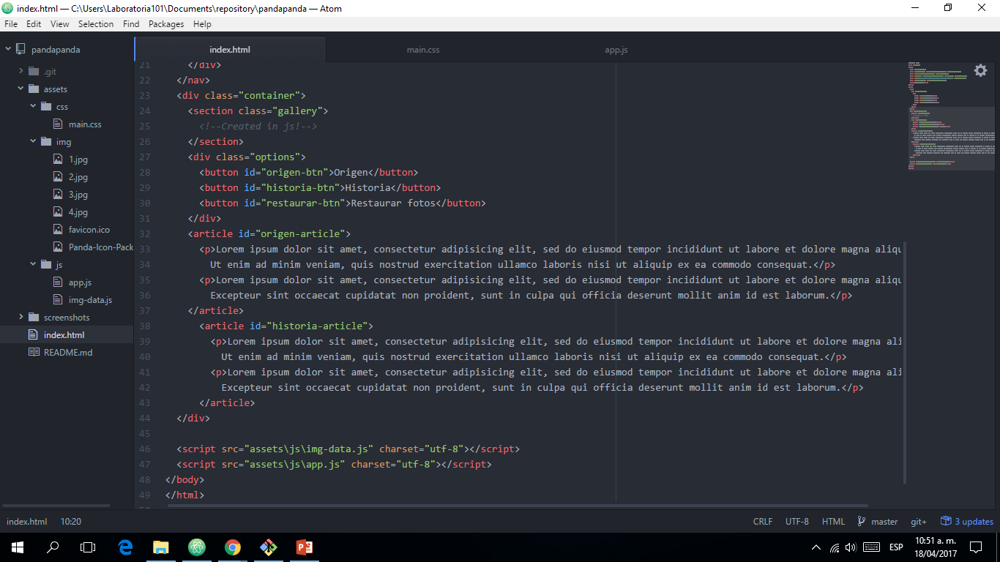
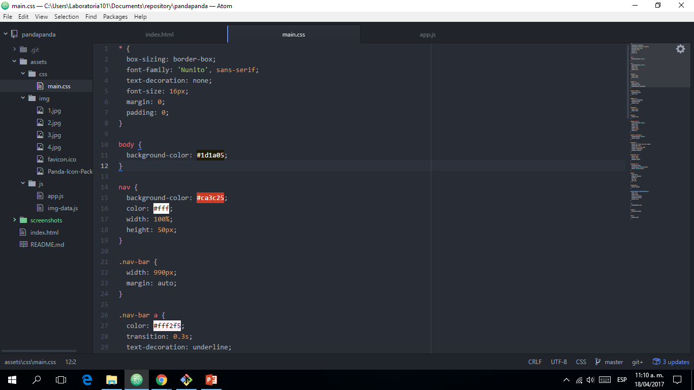
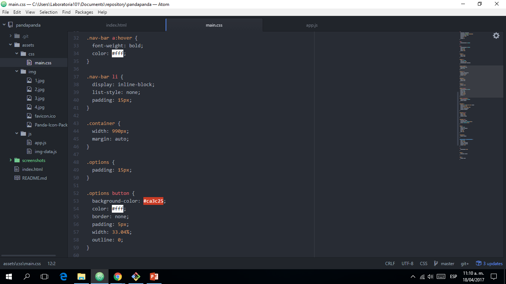
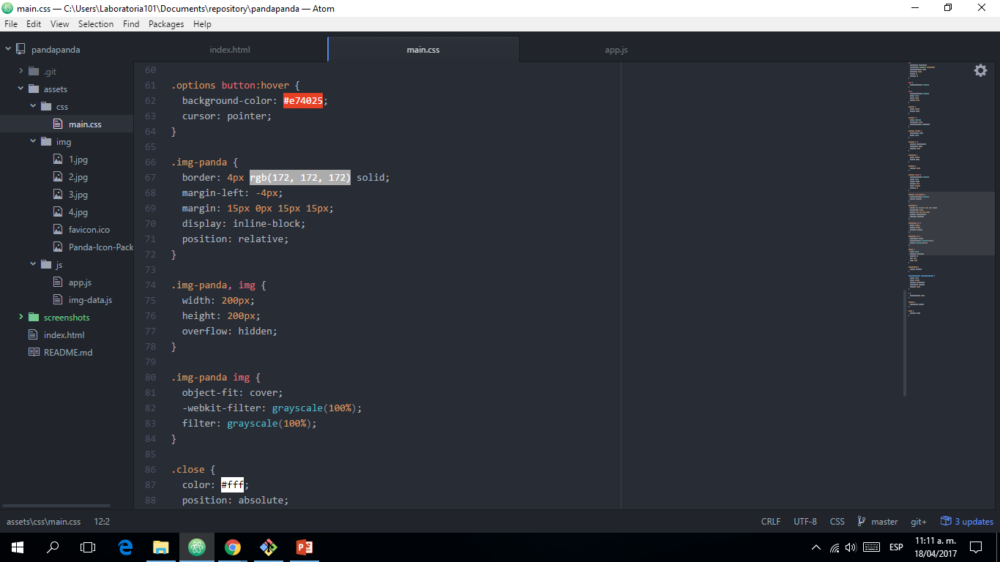
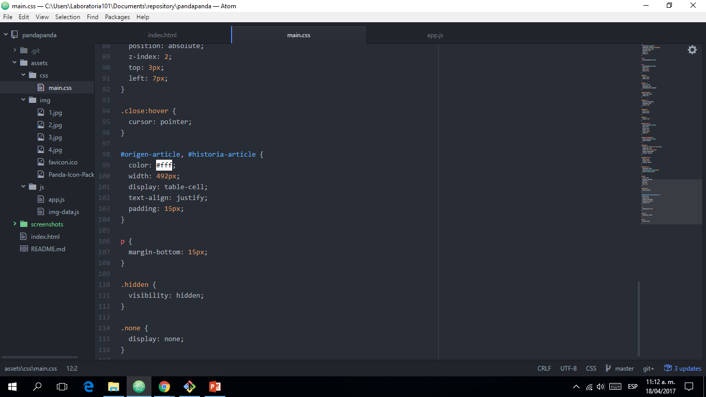
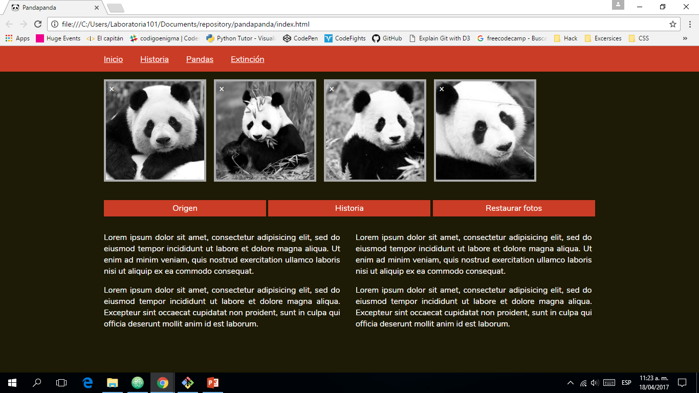
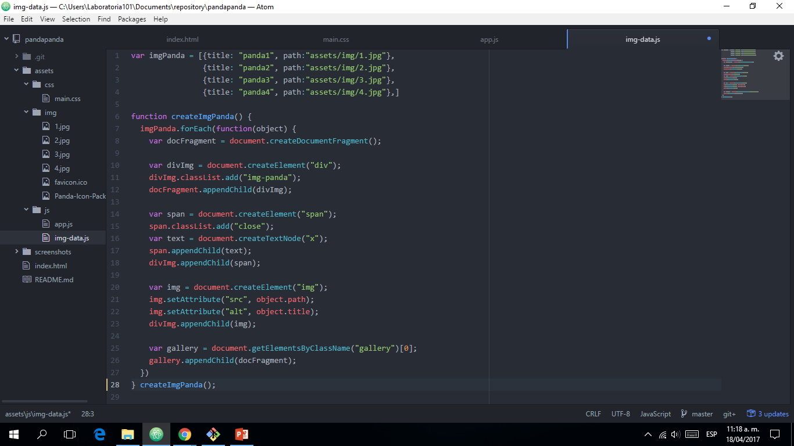
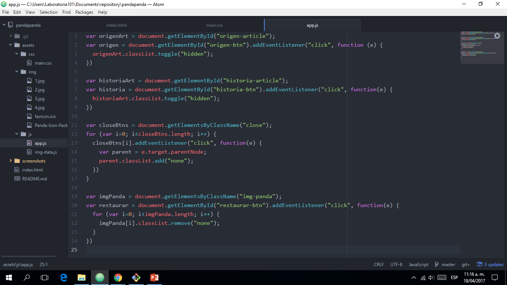
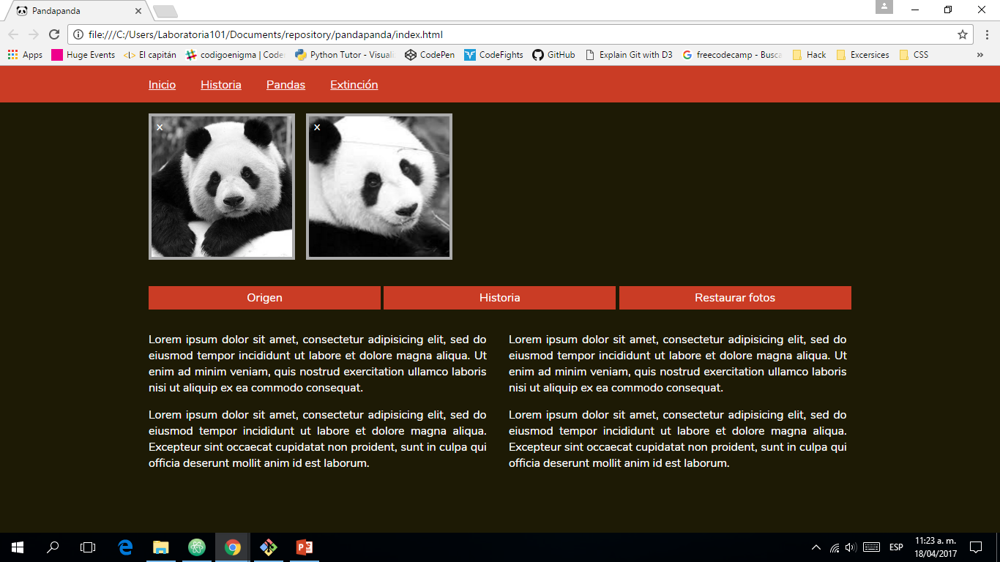
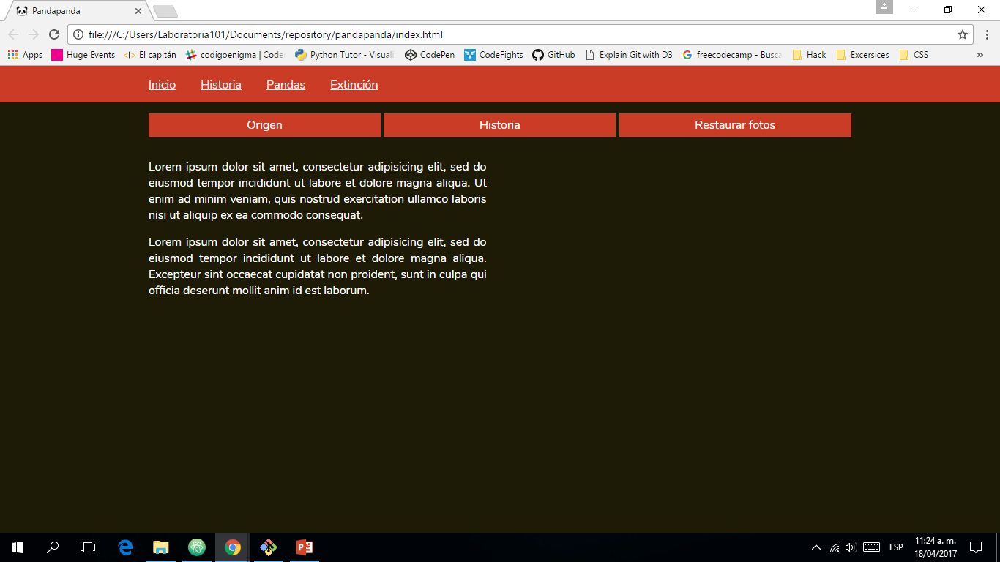

# Pandapanda

## Acerca del proyecto

En este proyecto se desarrolló la página web de la organización Pandapanda, la cuál tiene como objetivo difundir información acerca de la vida silvestre de los pandas. Para ello se estructuró el sitio en tres secciones: barra de navegación, galería de imágenes y sección de artículos, las cuales fueron dotadas de funcionalidades y diseño de acuerdo a lo solicitado.

Mira el demo [aquí.](https://mishmore.github.io/pandapanda/)

## Requerimientos

### Diseño

+ "Pixel Perfect"
+ Respetar los colores de la organización.

### Funcionalidad

#### Fotos
+ Eliminar foto al presionar "x".
+ No dejar espacios vacíos al eliminarse todas las fotos.
+ Restaurar las fotos eliminadas con el botón "Restaurar".

#### Texto
+ Al hacer click en el botón "Origen" mostrar/ocultar la información de la colummna izquierda.
+ Al hacer click en el botón "Historia" mostrar/ocultar la información de la colummna derecha.

## Proceso

### Estructura
Se comenzó configurando el documento con una tipografía Sans Serif y el logotipo de la organización **Pandapanda** como favicon de la página. Según lo mencionado anteriormente, la página debía incluir tres secciones: barra de navegación, galería de imágenes y sección de artículos. En el documento HTML se trabajaron éstas áreas de la página con etiquetas nav, section y article. Las etiquetas (a exepción de la etigueta nav) se incluyeron en un contenedor para dotarlas de propiedades de tamaño y margen. Todas ellas fueron llenas con el texto brindado en la muestra del requerimiento.

La sección de galería se implementó dinámicamente mediante una función de Javascript que veremos más adelante.

### Diseño
Se definieron los valores iniciales de las cajas con border-box, margin, padding y tipo de fuente. A continuación se colocaron los colores para la barra de navegación y botones (rojo :#ca3c25) y para el fondo (marrón: #1d1a05).

En la contrucción de la barra de navegavión, la propiedad **list-style: none** se utilizó para remover los guiones característicos de la lista desordenada. Se utilizó también **display: inline-block** para colocar los enlaces de las pestañas uno al lado del otro.

Se le añadió propiedades de estilo a cada botón y un cambio de color al pasar el cursos con la propiedad **hover**. 
Se le añadieron propiedades de tamaño y **overflow: hidden** a div e imagen para evitar algún desborde. 
Se configuraron los estilos al div contenedor de la imagen y se le añadió la propiedad **position: relative** para poder situar el elemento "x" en su esquina superior izquierda. La propiedad **display: inline-block** fue utilizada para colocar una imagen junto a la otra. 
A la imagen se le aplicó un filtro de blanco y negro y **object-fit: cover** para que la imagen ocupe todo el tamaño de su contenedor  y así tener una uniformidad en las fotos y una escala sin distorsiones.

Se colocó el elemento "x" con **position: absolute** para poder situarlo donde corresponde y se comporte como un elemento clickeable.
A los artículos se les aplicó **display: table-cell** para darles el formato de dos columnas y con **text-align: justify** se justificó su contenido.
Se agregaron las clases **.hidden** y **.none** con propiedades de sus mismos nombres para utilizarlas luego con javascript.

Vista final de la página con CSS.

### Funcionalidad
Primero se trabajó en el área de almacenamiento de información, en éste caso imágenes, para lo cual se creó un array **imgPanda** con objetos que guardan el tíulo y ruta de las imágenes.
Luego, se implementó la función **createImgPanda()**, encargada de recorrer el array **imgPanda** e iniciar la creación de elementos div (contenedor de imagen), imagen y span ("x") por cada objeto encontrado. Cada elemento se agrega a un **documentFragment** para evitar el repintado de la página en cada iteración. Al finalizar la creación, se agrega el  **documentFragment** a la sección galería del documento. Finalmente, se ejecuta la función para que la página cargue inmediatamente con las imágenes creadas.

En el segundo documento documento js podemos encontrar la funcionalidad de los elementos clickeables. Para el boton de **Origen** e **Historia** se trabajo con **classList.toggle** para agregar/remover la clase **hidden**, que quita la visualización a la columna de texto. Para ocultar las imagenes se trabajó con **target.parentNode** para identificar al div padre del span clickeado y así darle la clase **.none**. El último boton **restaurar** remueve todas las clases **.none** de las imágenes.

Vista al hacer click en "x" en la imagen.

Espacio de imagenes retraído si se eliminan todas.

Ocultar los textos de Origen e Historia

## Construido con
+ HTML5
+ Javascript
+ CSS

## Créditos
[Michelle More](https://github.com/Mishmore/)

